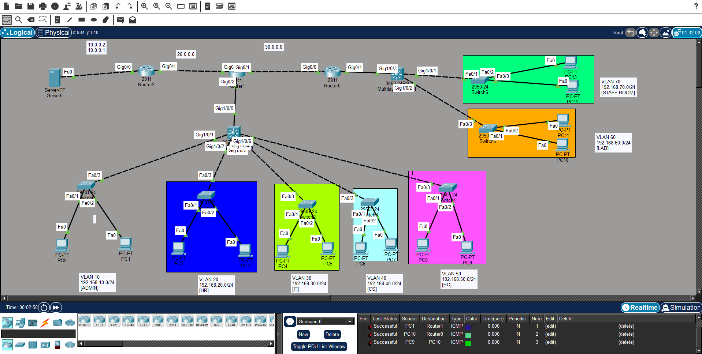

# CCNA Networking Project – Cisco Packet Tracer

## 📌 Project Overview

This project is a departmental computer network designed and simulated using **Cisco Packet Tracer**. It demonstrates practical CCNA networking concepts such as **VLANs, IPv4 addressing, subnetting, routing, switching, and network connectivity**.

The network consists of multiple routers, a multilayer switch, access switches, a server, and multiple PCs. The network is divided into separate VLANs for different departments.

## 🌐 Network Topology



The topology includes:

- Multiple Cisco routers
- Multilayer switch
- Access switches
- Server
- Multiple PCs
- Department-based VLANs
- Interconnected network segments

## 🏢 VLAN Configuration

| VLAN | Department | Network |
|---|---|---|
| VLAN 10 | Administration | 192.168.10.0/24 |
| VLAN 20 | HR | 192.168.20.0/24 |
| VLAN 30 | IT | 192.168.30.0/24 |
| VLAN 40 | CS | 192.168.40.0/24 |
| VLAN 50 | EC | 192.168.50.0/24 |
| VLAN 60 | Lab | 192.168.60.0/24 |
| VLAN 70 | Staff Room | 192.168.70.0/24 |

## 🛠️ Technologies & Tools

- Cisco Packet Tracer
- Cisco Routers
- Cisco 3650 Multilayer Switch
- Cisco 2950 Switches
- IPv4
- VLAN
- Subnetting
- Routing
- TCP/IP
- Cisco IOS CLI

## ⚙️ Networking Concepts Implemented

- Network topology design
- VLAN configuration
- IPv4 addressing
- Subnetting
- Switching
- Routing
- Inter-network communication
- Network connectivity testing
- Cisco IOS configuration
- Network troubleshooting

## 🧪 Network Testing

The network configuration and connectivity can be verified using Cisco IOS commands such as:

```text
ping
tracert
ipconfig
show ip interface brief
show running-config
show vlan brief
show ip route
